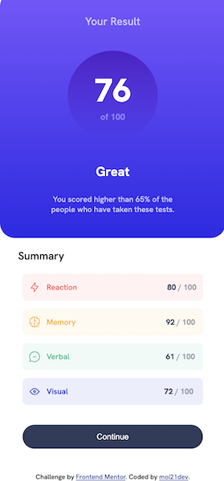

# Frontend Mentor - Results summary component solution

This is a solution to the [Results summary component challenge on Frontend Mentor](https://www.frontendmentor.io/challenges/results-summary-component-CE_K6s0maV). Frontend Mentor challenges help you improve your coding skills by building realistic projects. 

## Table of contents

- [Overview](#overview)
  - [The challenge](#the-challenge)
  - [Screenshot](#screenshot)
  - [Links](#links)
- [My process](#my-process)
  - [Built with](#built-with)
  - [What I learned](#what-i-learned)
  - [Continued development](#continued-development)
  - [Useful resources](#useful-resources)
- [Author](#author)

**Note: Delete this note and update the table of contents based on what sections you keep.**

## Overview

### The challenge

Users should be able to:

- View the optimal layout for the interface depending on their device's screen size
- See hover and focus states for all interactive elements on the page

### Screenshot

### Links

- Solution URL: 
- Live Site URL: [Github Pages](https://moi21dev.github.io/results-summary-component/)

## My process

### Built with

- Semantic HTML5 markup
- CSS custom properties
- Flexbox

### What I learned

Thanks to this project I moved my first steps towards:
- Flexbox
- Linear Gradient
- Media queries
- Responsive design

### Continued development

I defenitely want to learn Flexbox and CSS Grid better! These tools are useful for setting the layout of the page and making it responsive. 

### Useful resources

- [Flexbox guide](https://developer.mozilla.org/en-US/docs/Learn/CSS/CSS_layout/Flexbox) - This guide helped me better understand how Flexbox works and its properties.
- [Media queries](https://developer.mozilla.org/en-US/docs/Learn/CSS/CSS_layout/Media_queries) - This guide is useful for a quick recap on how media queries works.

## Author
- Frontend Mentor - [@ymoi21dev](https://www.frontendmentor.io/profile/moi21dev)